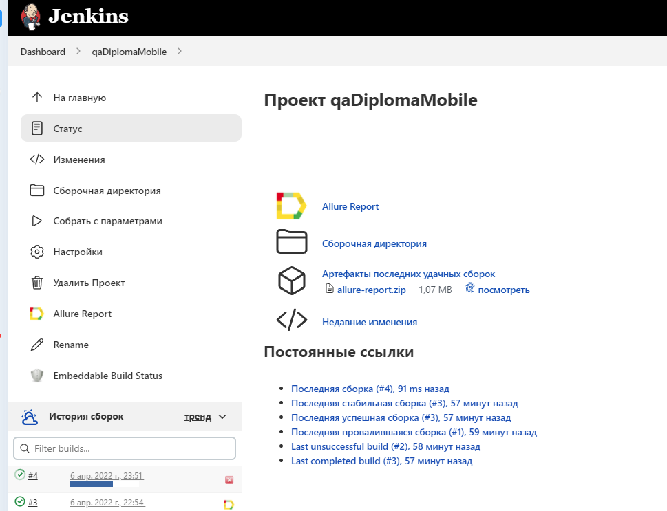
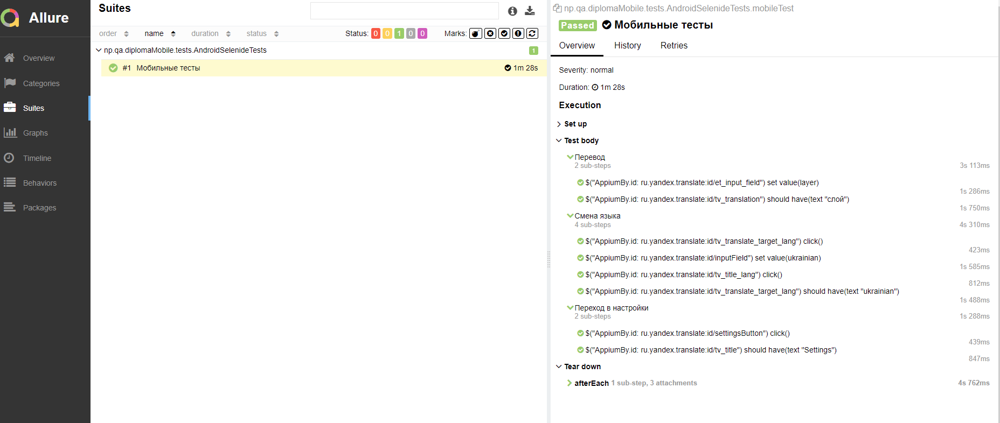
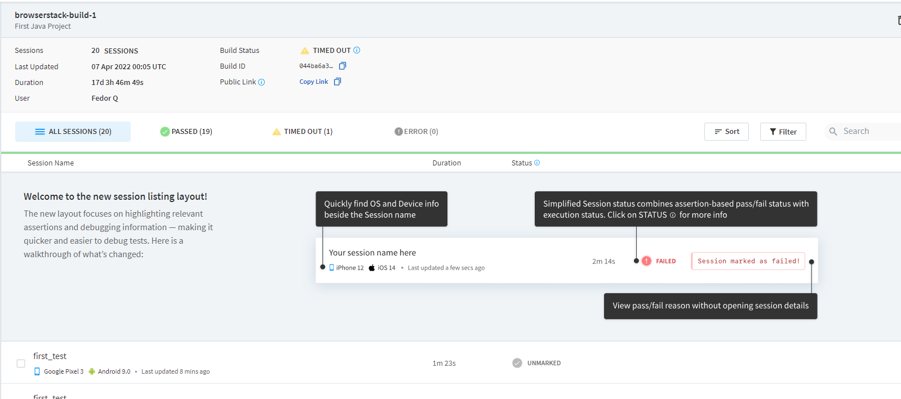
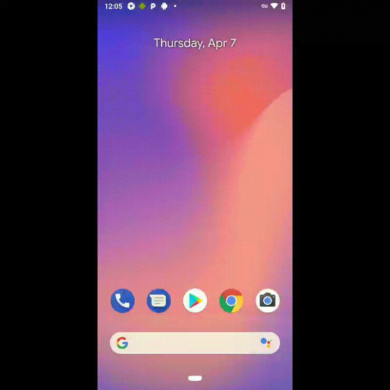

# Проект для домашки/диплома(mobile-часть)
<a target="_blank" href="https://play.google.com/store/apps/details?id=ru.yandex.translate">Яндекс переводчик</a>

## :pushpin: Содержание:

- [Технологии и инструменты](#rocket-технологии-и-инструменты)
- [Реализованные проверки](#Реализованные-проверки)
- [Jenkins job](#-Jenkins-job)
- [Окружения](#-computer-Запуск-тестов-из-терминала)
- [Allure отчет](#-Allure-отчет)
- [BrowserStack](#-BrowserStack)

## :rocket: Технологии и инструменты

<p align="center">
<a href="https://www.jetbrains.com/idea/"></a>
<a href="https://www.java.com/"></a>
<a href="https://github.com/"></a>
<a href="https://junit.org/junit5/"></a>
<a href="https://gradle.org/"></a>
<a href="https://github.com/allure-framework/allure2"></a>
<a href="https://www.jenkins.io/"></a>
<a href="https://appium.io/index.html"></a>
<a href="https://www.browserstack.com/"></a>
<a href="https://developer.android.com/studio"></a>
</p>

## Реализованные проверки

- ✓ Проверка перевода.
- ✓ Проверка смены языка.
- ✓ Проверка настроек.


## </a> Jenkins job
<a target="_blank" href="https://jenkins.autotests.cloud/job/qaDiplomaMobile/">Сборка в Jenkins</a>
<p align="center">
<a href="https://jenkins.autotests.cloud/job/qaDiplomaMobile/"></a>
</p>

## Параметры сборки в Jenkins: 

- ENV (окружение)


## :computer: Запуск тестов из терминала

Локальный и удаленный запуск:
```bash
локально и удаленно
gradle clean test -DdeviceHost=browserstack 
```
```bash
только локальный запуск через эмулятор
gradle clean test -DdeviceHost=emulation 
```
```bash
только локальный запуск на реальном устройстве
gradle clean test -DdeviceHost=realDevice 
```

## </a> Allure отчет

<a target="_blank" href="https://jenkins.autotests.cloud/job/qaDiplomaMobile/5/allure/">Аллюр</a>

<p align="center">

</p>


## </a> BrowserStack

<p align="center">

</p>

<p align="center">
 
</p>
